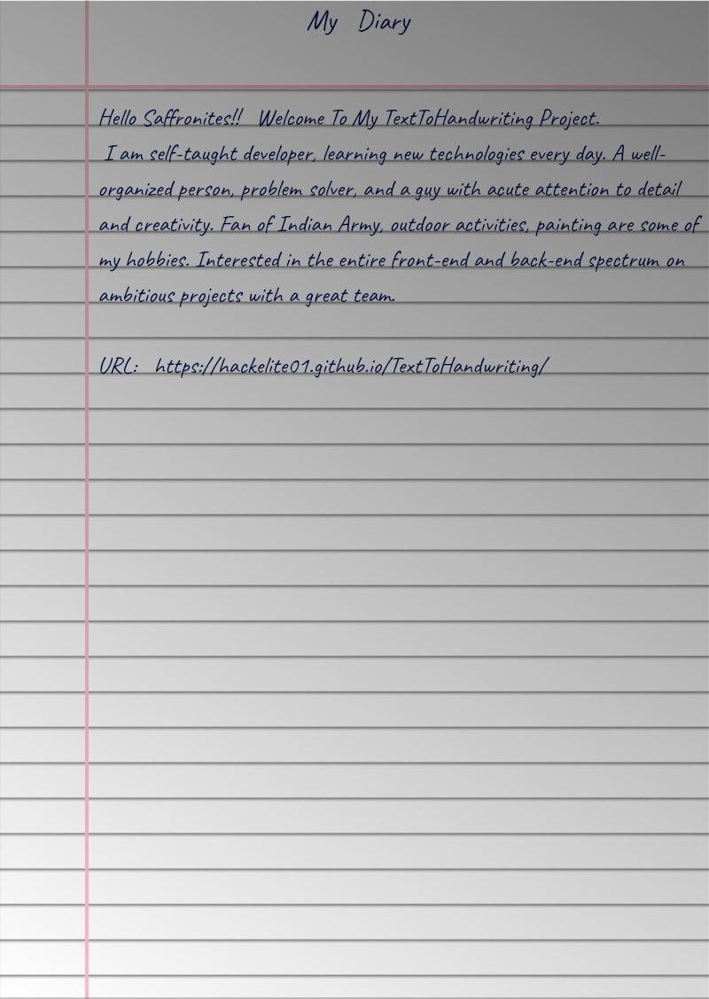

 I hate writing assignments so I made this tool that converts text to an image that looks like handwriting•04

##  Output

##  Contributing

Checkout [Contribution Guide](CONTRIBUTING.md) for local setup and contribution guide.

##  Libraries used

- [html2canvas](https://github.com/niklasvh/html2canvas) - Turns DOM into Canvas.
- [jsPDF](https://github.com/MrRio/jsPDF) - To generate PDF from images.
- [cypress](https://github.com/cypress-io/cypress) - Testing Library
- [serve](https://github.com/zeit/serve) - Start local server
 
---

Bye!
Have fun 
